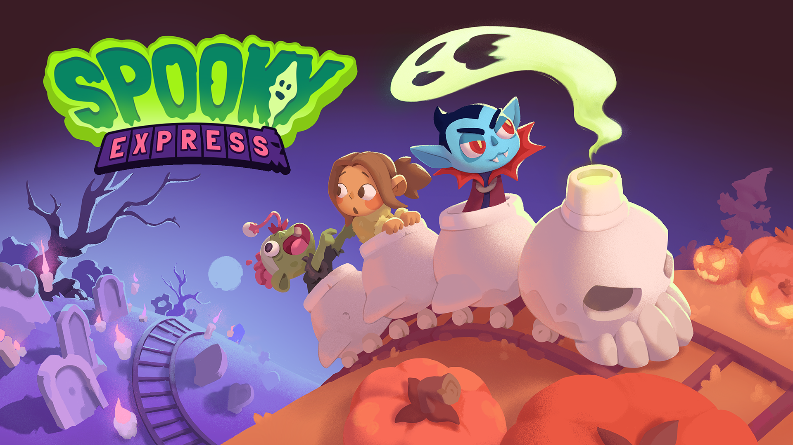

+++
date = '2025-09-19T18:44:01-04:00'
draft = true
title = 'Spooky Express'
[params]
    featured_img = 'splash.png'
+++

<!--  -->

(2025)
Windows/Mac/iOS/Android
Godot

Worked (2024-2025)

## Responsibilities
- Created several tools to improve team-member's workflows and make development more reliable.
- Implemented the majority of the UI/UX, including the settings, level select screen, and gameplay overlays.
- Created and maintained asset pipeline for comics, ui/ux, props, and characters.
- Created an Automatic Decoration System to populate levels with props and fit within certain design guidelines.
- Coordinate with my team to find bugs, current issues, and things to change.